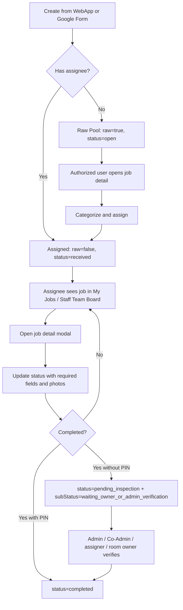
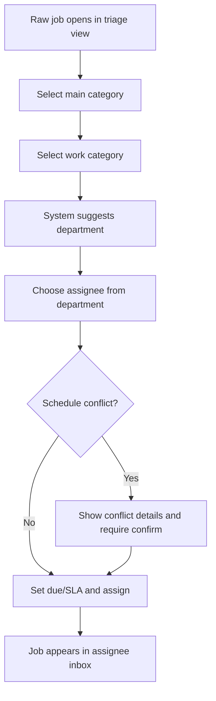
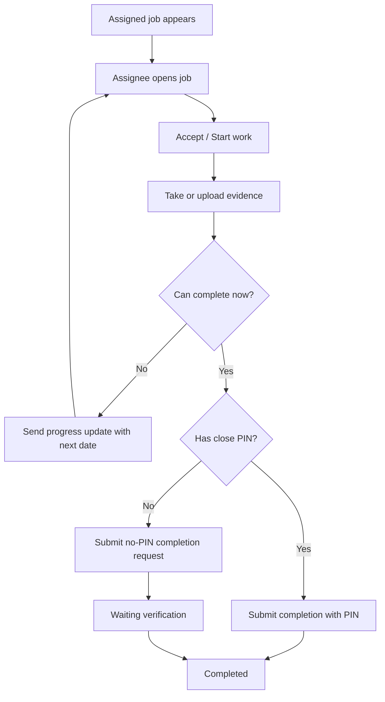
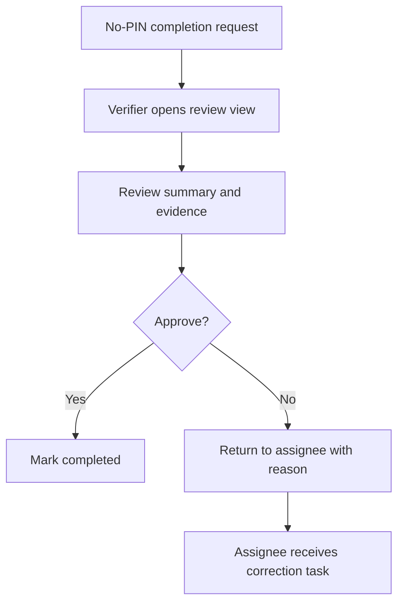

# Work Assignment, Job Detail, And Assignee UX Spec

เอกสารนี้อธิบายระบบสั่งงาน รายละเอียดงาน และการทำงานของผู้ได้รับมอบหมายตามสถานะปัจจุบันของ WebApp เพื่อใช้เป็นฐานในการปรับ UX/UI ใหม่ด้วยตัวเอง โดยเอกสารนี้เป็น current-state audit ไม่ใช่ข้อสรุปว่ารูปแบบปัจจุบันดีพอแล้ว

วันที่ตรวจ: 2026-07-10

## Source Files

- Runtime หลัก: `app.js`
- โครงหน้าและ modal: `index.html`
- styling: `styles.css`
- Supabase adapter: `supabase-client.js`
- Supabase schema/RPC: `supabase/migrations/202607090001_full_supabase_schema.sql`
- เอกสาร flow เดิม: `docs/04-WORK-ORDER-FLOW.md`
- gap review เดิม: `docs/16-GAP-REVIEW-AND-ROUTINE-WORK-PLAN.md`

## Scope

ระบบที่เกี่ยวข้องกับเอกสารนี้มี 5 ส่วนหลัก

1. การรับงานเข้าระบบจาก WebApp, Google Form, หรือข้อมูลตัวอย่าง
2. การคัดแยกงานและมอบหมายงานให้พนักงาน
3. การแสดงรายการงานบน list, board, dashboard, และ compact mode
4. หน้ารายละเอียดงานและ action ใน modal
5. workflow ของผู้ได้รับมอบหมาย ตั้งแต่เห็นงาน อัปเดตสถานะ แนบรูป ปิดงาน และรอการยืนยัน

## Core Concepts

### Job

`job` คือรายการงานหนึ่งรายการ เช่น งานแจ้งซ่อมห้องลูกบ้าน งานส่วนกลาง งานประจำ หรือรายการที่ดึงจาก Google Form

ข้อมูลสำคัญของ `job`

| Field | ความหมาย | ผลต่อ UX/UI |
| --- | --- | --- |
| `id` | เลขงาน เช่น `JC-260626-001` | ใช้แสดงบน card, modal, export, search |
| `source` | แหล่งที่มา เช่น `WebApp`, `Google Forms` | ช่วยแยกงานที่สร้างเองกับงานที่ ingest เข้ามา |
| `raw` | งานยังไม่ถูกคัดแยก/มอบหมาย | ถ้า `true` จะอยู่ใน Pool และขึ้น badge `POOL` |
| `mainCategory` | กลุ่มใหญ่ `common` หรือ `resident` | แยกงานส่วนกลางกับงานลูกบ้าน |
| `category` | ประเภทงานย่อย เช่น plumbing, electrical, cleaning | ใช้ icon, สี, filter, board |
| `title` | หัวข้องาน | แสดงเป็นชื่อหลักของ card และ modal |
| `issueDescription` | รายละเอียดปัญหา | แสดงใน hero ของ modal |
| `roomNo` / `room` | เลขห้องหรือพื้นที่ | ใช้สิทธิ์ resident และ search |
| `building` / `floor` | อาคารและชั้น | แสดงใน card และ modal |
| `contactName` / `contactPhone` | ผู้ติดต่อและเบอร์ | แสดงใน modal และ card meta |
| `jobDate` | วันที่งาน | ใช้ board range, conflict check, display |
| `startTime` / `endTime` | เวลาเริ่ม/สิ้นสุด | ใช้ตรวจเวลาทับซ้อนของผู้รับงาน |
| `dueDate` | วันครบกำหนด | ใช้ due badge และ detail grid |
| `slaNote` | หมายเหตุ SLA | แสดงใน detail grid |
| `priority` | normal, high, urgent | แสดงเป็น pill |
| `assignee` | user id ของผู้ได้รับมอบหมาย | ควบคุมการเห็นงานใน `งานของฉัน` |
| `assigneeName` | ชื่อผู้ได้รับมอบหมาย | แสดงใน card/modal |
| `assignedBy` | user id ของผู้มอบหมาย | ใช้สิทธิ์ update/verify และแสดงใน modal |
| `status` | สถานะหลัก | คุม column, filter, badge, validation |
| `subStatus` | สถานะย่อย | ใช้กรณีช่างแจ้งเสร็จแต่ไม่มี PIN |
| `closePin` | PIN ปิดงาน | เห็นเฉพาะผู้มีสิทธิ์ และใช้ปิดงานแบบมี PIN |
| `attachments` | รูป/ไฟล์แนบของงาน | แสดงใน modal และใช้เป็นหลักฐาน |
| `statusUpdates` | ประวัติการ update สถานะ | ใช้ตรวจย้อนหลัง แต่ตอนนี้ไม่ได้แสดงแยกชัดเท่า timeline |
| `timeline` | timeline ของเหตุการณ์ | แสดงท้าย modal |
| `hasScheduleConflict` | มีเวลาทับซ้อนกับงานอื่น | แสดง badge และบันทึก timeline |

### Raw Job / Pool

งานที่ยังไม่มีผู้รับผิดชอบจะถูกตั้งค่าเป็น:

- `raw = true`
- `assignee = null`
- `status = open`

งานแบบนี้จะเข้าเมนู Pool หรือ `งานจากG-Form` ตามชื่อ sidebar ปัจจุบัน เพื่อให้ผู้มีสิทธิ์คัดแยกและมอบหมายต่อ

### Main Category

`mainCategory` แยกงานเป็น 2 กลุ่ม

| Key | ความหมาย | การใช้งาน |
| --- | --- | --- |
| `common` | งานส่วนกลาง | แสดงในงานส่วนกลางและสถานะงานส่วนกลางของลูกบ้าน |
| `resident` | งานลูกบ้าน | ผูกกับห้อง ผู้แจ้ง หรือเจ้าของห้อง |

ถ้าเป็น `common` ระบบจะตั้ง `areaType = common` และ `sharePublic = true`

### Department Vs Category

ระบบมีทั้ง department และ category ซึ่งเป็นคนละเรื่องกัน

- `department` คือแผนกของผู้ใช้งาน เช่น นิติ, ช่าง, แม่บ้าน, รปภ., คนสวน
- `category` คือประเภทปัญหา/งาน เช่น ประปา, ไฟฟ้า, ความสะอาด, อาคาร, ลิฟต์

จุดที่ทำให้ UX สับสนได้ง่ายคือผู้ใช้มักคาดว่าเลือก category แล้วระบบจะรู้แผนกผู้รับงาน แต่ implementation ปัจจุบันยังให้เลือก `assignee` แยกเอง

## Current Status Model

สถานะหลักในระบบปัจจุบัน

| Status key | คำไทยที่ควรแสดง | ความหมายปัจจุบัน | หมายเหตุ UX |
| --- | --- | --- | --- |
| `open` | เปิดงาน / ยังไม่มอบหมาย | งานเข้าระบบแล้วแต่ยังไม่มีผู้รับผิดชอบ | ใช้กับ Pool |
| `received` | รับเรื่อง | งานถูกมอบหมายแล้ว หรือผู้รับงานเลือกสถานะรับเรื่อง | ปัจจุบันยังไม่แยก "ถูกมอบหมาย" กับ "ผู้รับกดรับงาน" |
| `pending_inspection` | รอตรวจสอบ | ต้องเข้าตรวจสอบหน้างาน | ต้องกรอกวันที่ตรวจสอบและแนบรูป |
| `inspected_waiting_repair` | ตรวจสอบแล้วรอแก้ไข/อะไหล่ | ตรวจแล้ว พบสาเหตุและแนวทางแก้ไข | ต้องกรอกวันที่ สาเหตุ แนวทางแก้ไข และแนบรูป |
| `repaired_follow_up` | แก้ไขแล้ว รอติดตาม | แก้แล้วแต่ยังต้องติดตามผล | ต้องกรอกวันติดตามถัดไปและแนบรูป |
| `temporary_waiting_parts` | แก้ไขเบื้องต้น รออะไหล่/ผู้รับเหมา | แก้ชั่วคราวแล้ว รอของหรือผู้รับเหมา | ต้องกรอกวันติดตามถัดไปและแนบรูป |
| `completed` | แก้ไขเรียบร้อยสมบูรณ์แล้ว | ปิดงานสมบูรณ์ | ต้องใช้ PIN หรือ no-PIN verification |
| `rejected` | ปฏิเสธงาน | ไม่รับหรือปฏิเสธงาน | ไม่บังคับแนบรูป |

สถานะย่อย

| Sub status key | คำไทยที่ควรแสดง | ความหมาย |
| --- | --- | --- |
| `waiting_owner_or_admin_verification` | ช่างแจ้งเสร็จแล้ว รอตรวจสอบ | ผู้ปฏิบัติงานบอกว่าเสร็จแล้ว แต่ไม่มี PIN จึงต้องรอผู้มีสิทธิ์ยืนยันก่อนนับเป็น completed |

## Current End-To-End Flow

## Permission Model For Jobs

### View Permission

| User type | เห็นงานอะไร |
| --- | --- |
| Admin | เห็นทุกงาน |
| Co-Admin | เห็นทุกงาน |
| ผู้มีสิทธิ์ assign เช่น `canAssign`, `assignL1`, `assignL2` | เห็นทุกงาน |
| Staff ทั่วไป | เห็นเฉพาะงานที่ `assignee` เป็นตัวเอง |
| Resident | เห็นงานของห้องตัวเอง หรือที่ตัวเองเป็นผู้แจ้ง |

### Update Permission

ผู้ที่ update งานได้

- Admin
- Co-Admin
- ผู้ได้รับมอบหมาย (`assignee`)
- ผู้มอบหมาย (`assignedBy`)

### Close PIN Visibility

ผู้ที่เห็น `closePin`

- Admin
- Co-Admin
- ผู้มอบหมาย
- ผู้แจ้ง
- Resident ที่เป็นเจ้าของห้องของงานนั้น

ผู้รับงานทั่วไปไม่เห็น PIN ใน PIN card แต่จะเห็นช่องให้กรอก PIN ตอนเลือกปิดงาน

### Completion Verification

ผู้ที่กดยืนยันงาน no-PIN ได้

- Admin
- Co-Admin
- ผู้มอบหมาย
- Resident ที่เป็นเจ้าของห้องของงานนั้น

ระบบจะอนุญาตเฉพาะงานที่มี `subStatus = waiting_owner_or_admin_verification`

## Current UI Surfaces

### 1. Create Job Modal

จุดเปิด:

- ปุ่ม `สร้างงานใหม่` บน topbar
- แสดงเฉพาะบัญชีที่มี action permission `createJob`

field ที่เกี่ยวข้อง:

- ประเภทหลัก: งานส่วนกลาง / งานลูกบ้าน
- ประเภทย่อย: ประปา, ไฟฟ้า, ความสะอาด, โครงสร้างอาคาร, ลิฟต์, สวน, เฟอร์นิเจอร์, ระบบความปลอดภัย, อินเทอร์เน็ต
- วันที่งาน
- เวลาเริ่ม
- เวลาสิ้นสุด
- วันครบกำหนด
- หมายเหตุ SLA
- เลขห้อง
- ตึก
- ชั้น
- ผู้ติดต่อ
- เบอร์ติดต่อ
- รายละเอียดปัญหา
- ความสำคัญ
- ผู้ได้รับมอบหมาย
- รูปภาพเริ่มต้น

behavior:

- ถ้าไม่เลือกผู้ได้รับมอบหมาย งานจะเข้า Pool เป็น `raw=true`, `status=open`
- ถ้าเลือกผู้ได้รับมอบหมาย งานจะเป็น `raw=false`, `status=received`
- ถ้าเลือกเวลาแล้วผู้รับงานมีงานช่วงเดียวกัน ระบบจะแสดง confirm ก่อนสร้าง
- รูปแนบได้สูงสุด 3 รูป
- รูปละไม่เกิน 5MB
- รูปถูก stamp ชื่อผู้ใช้และเวลาโดยอัตโนมัติ

### 2. Job List Row

แต่ละรายการงานแสดงข้อมูลหลัก:

- icon หรือ badge `RAW`
- ชื่องาน
- badge เพิ่มเติม เช่น POOL, รูปแนบ, เวลาซ้อน, รอตรวจสอบ, ไม่มี PIN
- เลขงาน
- วันที่และเวลา
- ห้อง/ตึก/ชั้น
- ผู้ติดต่อ/เบอร์
- priority pill
- assignee avatar หรือข้อความยังไม่มอบหมาย
- status pill
- ปุ่ม/ลูกศรเปิดรายละเอียด

filter ที่ใช้กับ list:

- search จากหัวข้องาน ห้อง หรือเลขงาน
- status filter
- category filter

ข้อจำกัด:

- ข้อมูลสำคัญบางส่วน เช่น due/SLA และ next update อยู่ใน modal มากกว่า card
- list row ไม่บอก primary next action ของผู้รับงาน

### 3. Staff Team Board / งานของทีมงาน

หน้า board ใช้กับ view เหล่านี้:

- งานส่วนกลาง
- งานของฉัน
- งานของลูกบ้าน
- งานของทีมงาน
- view เก่าที่ map เข้ามา เช่น งานทีมช่าง, งานแม่บ้าน, งานทีมนิติ

ส่วนประกอบ:

- Main Filter เฉพาะ `งานของทีมงาน`
- dropdown แบบติ๊กหลายตัวเลือกสำหรับแผนก
- ปุ่มยืนยัน
- ปุ่มล้างตัวเลือก
- board แบบ column ตามสถานะ
- date range filter เช่น 1 วัน, 7 วันย้อนหลัง, 30 วันย้อนหลัง, ทั้งหมด

column ปัจจุบัน:

- open
- received
- pending_inspection
- inspected_waiting_repair
- repaired_follow_up
- temporary_waiting_parts
- waiting_owner_or_admin_verification
- completed
- rejected

card บน board แสดง:

- category icon + category label
- job id
- title
- room/building
- priority
- assignee avatar หรือยังไม่มอบหมาย

ข้อจำกัด:

- board ช่วยมองภาพรวม แต่ action จริงยังต้องเปิด modal
- Main Filter เป็นแผนก ไม่ใช่ skill หรือ workload capacity
- ยังไม่มีแยกงานตามผู้รับผิดชอบเป็น swimlane

### 4. Job Detail Modal

modal ปัจจุบันเป็นจุดรวมทุกอย่างของงาน

ลำดับ section ใน modal:

1. Export actions: Export CSV, Export PDF
2. Detail hero
3. Detail grid
4. PIN card
5. Assignment controls
6. Technician/assignee update controls
7. Completion verification box
8. Timeline

#### Detail Hero

แสดง:

- status pill
- POOL badge ถ้าเป็น raw job
- เวลางานซ้อนถ้ามี conflict
- issue description
- attachment strip

#### Detail Grid

แสดง:

- วันที่งาน
- เวลา
- เลขห้อง
- ตึก / ชั้น
- ผู้ติดต่อ
- เบอร์ติดต่อ
- category
- reporter
- priority
- ผู้มอบหมาย
- ผู้ได้รับมอบหมาย
- วันติดตาม/อัปเดตถัดไป
- หมายเหตุ
- วันครบกำหนด
- หมายเหตุ SLA

#### PIN Card

ถ้ามีสิทธิ์เห็น PIN:

- แสดง PIN ปิดงาน
- มีข้อความอธิบายว่าแสดงเฉพาะ Admin / ผู้มอบหมาย / เจ้าของห้อง / ผู้แจ้ง

ถ้าไม่มีสิทธิ์:

- แสดงเป็น `••••`
- อธิบายว่าผู้รับงานจะเห็นเฉพาะช่องกรอก PIN ตอนปิดงาน

#### Assignment Controls

แสดงเฉพาะผู้มีสิทธิ์ assign

field:

- ประเภทหลัก
- ประเภทย่อย
- ผู้ได้รับมอบหมาย
- วันครบกำหนด
- หมายเหตุ SLA

เมื่อ submit:

- ตรวจเวลาทับซ้อนถ้ามี `startTime`
- ถ้าพบ conflict จะแสดง confirm
- เรียก `assignJob`
- ปิด modal
- render หน้าจอใหม่

#### Technician / Assignee Update Controls

แสดงเฉพาะผู้ที่ update งานได้

field หลัก:

- status selector
- note
- ปุ่มบันทึกสถานะ

field เพิ่มตาม status:

| Status | Field ที่เพิ่ม | Required |
| --- | --- | --- |
| `received` | ไม่มี field เพิ่ม | ไม่ต้องแนบรูป |
| `pending_inspection` | วันที่เข้าตรวจสอบ | ต้องกรอกวันที่และแนบรูป |
| `inspected_waiting_repair` | วันที่ตรวจสอบ/อัปเดต, สาเหตุ, แนวทางแก้ไข | ต้องกรอกทั้งหมดและแนบรูป |
| `repaired_follow_up` | วันติดตาม/อัปเดตครั้งถัดไป | ต้องกรอกวันที่และแนบรูป |
| `temporary_waiting_parts` | วันติดตามอะไหล่/ผู้รับเหมาครั้งถัดไป | ต้องกรอกวันที่และแนบรูป |
| `completed` | PIN หรือ no-PIN reason, วันที่เสร็จงาน | ต้องแนบรูป และต้องมี PIN หรือเหตุผล no-PIN |
| `rejected` | ไม่มี field เพิ่ม | ไม่ต้องแนบรูป |

รูป:

- ปุ่มถ่ายรูป
- ปุ่มแนบรูป
- ขั้นต่ำ 1 รูปสำหรับทุก status ยกเว้น `received` และ `rejected`
- สูงสุด 3 รูป
- รูปละไม่เกิน 5MB
- มี stamp ชื่อผู้ใช้และเวลา

#### Completion Verification Box

แสดงเฉพาะงานที่:

- `subStatus = waiting_owner_or_admin_verification`
- ผู้ใช้ปัจจุบันมีสิทธิ์ verify

เมื่อกด:

- เรียก `verifyCompletion`
- เปลี่ยน `status = completed`
- ล้าง `subStatus`
- บันทึก timeline

#### Timeline

แสดงลำดับเหตุการณ์ เช่น:

- สร้างงาน
- มอบหมายงาน
- ยืนยันเวลาทับซ้อน
- เปลี่ยนสถานะ
- แจ้งเสร็จแบบไม่มี PIN
- ยืนยันปิดงาน

ข้อจำกัด:

- timeline เป็นข้อความรวม ไม่ได้แยก evidence, decision, field changes อย่างเป็นหมวด
- `statusUpdates` มีข้อมูล structured มากกว่า แต่ UX ปัจจุบันยังไม่ได้ทำเป็น history panel ที่อ่านง่าย

### 5. Compact Mode

Compact mode มีหน้าที่เป็น mobile-first simplified interface

แนวคิด:

- ตัวเต็มใช้ WebApp เดิม
- ตัวย่อใช้หน้าจอสั้นกว่า มี bottom navigation
- Resident มี tab เช่น หน้าแรก, แจ้งซ่อม, ห้องของฉัน
- Staff/Admin มี tab ตามบทบาท เช่น ภาพรวม, คัดแยกงาน, ตรวจงานประจำ, งานวันนี้, งานของฉัน

ความเกี่ยวข้องกับระบบงาน:

- Compact card แสดงรายการงานแบบสั้น
- action บางอย่างเป็นปุ่มเร็ว เช่น เริ่มงาน, ส่งงาน
- Resident กดแจ้งซ่อมแล้วไป Google Form ตาม config

ข้อจำกัด:

- Compact mode ยังไม่ได้แทน job detail workflow เต็ม
- การ update status ลึกยังผูกกับ modal/full workflow เป็นหลัก

## Assignee Workflow As Implemented

### Step 1: งานเข้าหาผู้รับงาน

งานจะเข้าหาผู้รับงานเมื่อ:

- ผู้สร้างงานเลือก assignee ตั้งแต่ตอนสร้าง
- หรือผู้มีสิทธิ์ assign เปิดงานจาก Pool แล้วมอบหมาย

หลังมอบหมาย:

- `raw = false`
- `assignee = user.id`
- `assignedBy = currentUser.id`
- `status = received`
- บันทึก timeline action `assigned`

### Step 2: ผู้รับงานเห็นงาน

ผู้รับงานทั่วไปเห็นงานได้จาก:

- `งานของฉัน`
- board ของทีมงาน ถ้าสิทธิ์อนุญาต
- compact mode ถ้าเลือก interface แบบตัวย่อ

ข้อสำคัญ:

- Staff ทั่วไปเห็นเฉพาะงานที่ assign ให้ตัวเอง
- ไม่มีหน้า inbox ที่แยก "งานใหม่ที่ยังไม่ได้กดรับ" ออกจาก "งานกำลังทำ"

### Step 3: ผู้รับงานเปิดรายละเอียด

เมื่อกด card จะเปิด job detail modal

ผู้รับงานจะเห็น:

- รายละเอียดปัญหา
- สถานที่
- ผู้ติดต่อ
- ผู้มอบหมาย
- รูปแนบ
- form อัปเดตสถานะ
- timeline
- ช่องกรอก PIN ตอนเลือก completed

ผู้รับงานอาจไม่เห็น:

- close PIN ใน PIN card ถ้าไม่มีสิทธิ์
- assignment controls ถ้าไม่มีสิทธิ์ assign

### Step 4: ผู้รับงานอัปเดตสถานะ

ผู้รับงานเลือกสถานะจาก dropdown แล้วระบบจะแสดง field เฉพาะสถานะนั้น

ตัวอย่าง:

- ถ้าจะเข้าตรวจสอบ เลือก `รอตรวจสอบ`, กรอกวันที่, แนบรูป
- ถ้าตรวจแล้วเจอปัญหา เลือก `ตรวจสอบแล้วรอแก้ไข/อะไหล่`, กรอกสาเหตุและแนวทางแก้ไข, แนบรูป
- ถ้าแก้เสร็จแล้วแต่ต้องติดตาม เลือก `แก้ไขแล้ว รอติดตาม`, กรอกวันติดตาม, แนบรูป
- ถ้าแก้ชั่วคราว เลือก `แก้ไขเบื้องต้น รออะไหล่/ผู้รับเหมา`, กรอกวันติดตาม, แนบรูป
- ถ้าปิดงาน เลือก `แก้ไขเรียบร้อยสมบูรณ์แล้ว`, กรอก PIN หรือเลือก no-PIN, แนบรูป

### Step 5: ปิดงานด้วย PIN

ถ้าผู้รับงานมี PIN:

- เลือกสถานะ completed
- กรอก PIN 4 หลัก
- แนบรูป
- ถ้า PIN ตรงกับ `job.closePin` งานจะเป็น completed ทันที

### Step 6: ปิดงานแบบไม่มี PIN

ถ้าขอ PIN ไม่ได้:

- เลือก completed
- ติ๊ก `ลูกบ้านไม่อยู่ / ไม่สามารถขอ PIN ได้`
- กรอกเหตุผล
- แนบรูป
- ระบบไม่ปิดงานเป็น completed ทันที
- ระบบเปลี่ยนเป็น `status = pending_inspection`
- ตั้ง `subStatus = waiting_owner_or_admin_verification`

ผลต่อ UX:

- งานยังไม่ถูกนับเป็น completed
- ผู้มีสิทธิ์ต้องกลับมาตรวจและกด confirm

### Step 7: ผู้มีสิทธิ์ยืนยันปิดงาน

Admin, Co-Admin, ผู้มอบหมาย หรือเจ้าของห้องเปิดงาน แล้วกดปุ่มยืนยันปิดงาน

ผลลัพธ์:

- `status = completed`
- `subStatus = ""`
- set `completedAt`
- บันทึก timeline

## Backend And Supabase Direction

Production path ที่วางไว้คือ Supabase-first

ตารางที่เกี่ยวข้อง:

- `jobs`
- `job_close_pins`
- `job_timeline`
- `job_attachments`
- `audit_logs`
- `google_form_submissions`
- `permissions`
- `sidebar_preferences`
- `app_users`
- `rooms`
- `room_profiles`

RPC ที่ควรใช้สำหรับ workflow:

- `create_job`
- `assign_job`
- `update_job_status`
- `verify_job_completion`

เหตุผลที่ควรใช้ RPC:

- workflow สำคัญต้อง atomic
- RLS ต้องควบคุมสิทธิ์
- close PIN ไม่ควรถูก expose ผ่าน table ตรงๆ
- audit log ควร append-only

Frontend adapter ปัจจุบันมี function:

- `createJob(payload)`
- `assignJob(jobId, assigneeId, extra)`
- `updateJobStatus(jobId, payload)`
- `verifyCompletion(jobId)`
- `uploadJobAttachment(file, jobId)`
- `signedUrl(bucket, path)`

## Current UX Problems And Risks

### 1. Detail Modal รวมหลายงานมากเกินไป

modal เดียวทำหน้าที่:

- อ่านรายละเอียด
- export
- ดู PIN
- มอบหมาย
- อัปเดตสถานะ
- ปิดงาน
- ยืนยันปิดงาน
- ดู timeline

ผลคือผู้ใช้แต่ละบทบาทเจอข้อมูลที่ไม่ได้เกี่ยวกับ action หลักของตัวเองมากเกินไป

### 2. สถานะ `received` คลุมเครือ

ตอนนี้ `received` หมายถึงงานถูกมอบหมายแล้ว และยังใช้เป็นสถานะที่ผู้รับงานเลือกได้

ปัญหา:

- ไม่รู้ว่าผู้รับงาน "รับทราบแล้ว" จริงหรือยัง
- ไม่มีเวลา accepted ที่เกิดจากการกดรับงานจริง ยกเว้นกรณี update status เป็น received
- dashboard อาจตีความเป็นงานกำลังดำเนินการ ทั้งที่ผู้รับอาจยังไม่เปิดดู

### 3. Assignment กับ Execution อยู่บนหน้าจอเดียวกัน

ผู้มอบหมายและผู้ปฏิบัติงานใช้ modal เดียวกัน แต่ต้องการคนละ flow

- ผู้มอบหมายต้องการเห็น workload, category, assignee, due/SLA
- ผู้ปฏิบัติงานต้องการรู้ว่าต้องไปไหน ทำอะไร ถ่ายรูปอะไร กดปุ่มไหนต่อ

### 4. Field เฉพาะสถานะเยอะและซ่อนอยู่ใน dropdown

ผู้ใช้ต้องเลือก status ก่อนจึงรู้ว่าต้องกรอกอะไร

ผลคือ:

- อาจเลือก status ผิดเพื่อดู field
- rule รูป/วันที่/PIN ไม่ชัดตั้งแต่แรก
- งาน mobile ใช้งานหนักเกินไป

### 5. PIN Flow และ No-PIN Flow ยังอ่านยาก

ผู้รับงานไม่เห็น PIN แต่ต้องกรอก PIN ตอน completed

ปัญหา:

- ผู้รับงานอาจไม่เข้าใจว่าต้องขอ PIN จากใคร
- no-PIN ทำให้งานเด้งเป็น pending inspection พร้อม subStatus ซึ่งอาจดูเหมือนงานย้อนสถานะ
- ผู้ตรวจงานต้องเข้า modal เดิมเพื่อหา action ยืนยัน

### 6. Board บอกสถานะ แต่ไม่ได้บอก next action

kanban board แยก column ได้ แต่ card ยังไม่บอกว่าใครต้องทำอะไรต่อ

ตัวอย่างสิ่งที่ยังขาด:

- รอผู้รับงานกดรับ
- รอเข้าตรวจ
- รออัปโหลดรูป
- รอ Admin verify
- รออะไหล่ถึงวันที่ใด

### 7. Permission เห็นงานกว้างสำหรับคนที่ assign ได้

ผู้มี `canAssign`, `assignL1`, `assignL2` เห็นทุกงานเหมือนผู้ดูแลในระดับหนึ่ง

อาจเหมาะกับนิติ แต่ถ้าต้องแยกแผนกจริงควรระบุให้ชัดว่า:

- ใครเห็นงานข้ามแผนกได้
- ใครเห็นเฉพาะงานของแผนก
- ใคร assign ได้เฉพาะบาง department

### 8. งานส่วนกลางกับงานลูกบ้านยังปน field กัน

งานส่วนกลางยังใช้ field room/building/floor/contact คล้ายงานลูกบ้าน

ควรพิจารณาแยก location model:

- ห้องลูกบ้าน
- พื้นที่ส่วนกลาง
- อาคาร/ชั้น/จุดติดตั้ง
- asset เช่น lift, pump, CCTV

### 9. `statusUpdates` ยังไม่ถูกใช้เป็น UX history ที่ดีพอ

ข้อมูล structured มีอยู่ แต่หน้าจอหลักใช้ timeline message เป็นหลัก

ควรแยก:

- Work log
- Evidence/photos
- Assignment changes
- Verification decisions

### 10. Board Logic มี code smell

ใน `getViewJobs` มี branch `commonWork` ซ้ำ 2 ครั้ง โดย branch ที่สองจะไม่ถูกเรียกเพราะ branch แรก return ไปแล้ว

เรื่องนี้ไม่จำเป็นต้องทำให้ UI พังทันที แต่ควร clean ก่อน redesign ใหญ่เพื่อไม่ให้ behavior ซ้อนกันโดยไม่ตั้งใจ

## Recommended Redesign Direction

ส่วนนี้เป็นแนวทางสำหรับปรับเอง ไม่ใช่ implementation ที่ทำในรอบนี้

### Principle 1: แยก Read, Assign, Work, Verify

ควรแยก mental model เป็น 4 flow

1. อ่านรายละเอียดงาน
2. คัดแยกและมอบหมาย
3. ปฏิบัติงานและส่งหลักฐาน
4. ตรวจรับและปิดงาน

ไม่จำเป็นต้องเป็น 4 หน้าเสมอไป แต่อย่างน้อย UI ควรแยก section และ primary action ให้ชัด

### Principle 2: หนึ่งบทบาทควรเห็นหนึ่ง primary action

ตัวอย่าง:

| Role / State | Primary action ที่ควรเด่น |
| --- | --- |
| Admin เห็น raw job | คัดแยกและมอบหมาย |
| ผู้รับงานเห็นงานใหม่ | รับงาน / เริ่มงาน |
| ผู้รับงานกำลังทำ | อัปเดตความคืบหน้า |
| ผู้รับงานแก้เสร็จ | ส่งปิดงาน |
| Admin เห็น no-PIN completed | ตรวจรับ / ยืนยันปิดงาน |
| Resident เห็นงานห้องตัวเอง | ดูสถานะ / ยืนยันถ้ามีสิทธิ์ |

### Principle 3: สถานะควรเป็น state machine ที่อ่านง่าย

ตัวอย่าง state ที่อาจพิจารณา:

- New
- Triaged
- Assigned
- Accepted
- In Progress
- Waiting Inspection
- Waiting Parts
- Waiting Verification
- Completed
- Rejected
- Reopened

ถ้าต้องใช้คำไทย:

- งานใหม่
- คัดแยกแล้ว
- มอบหมายแล้ว
- รับงานแล้ว
- กำลังดำเนินการ
- รอตรวจสอบ
- รออะไหล่/ผู้รับเหมา
- รอตรวจรับ
- เสร็จสิ้น
- ปฏิเสธ
- เปิดงานซ้ำ

### Principle 4: แยกสถานะงานออกจาก work note

หลายเรื่องไม่ควรเป็น status ทั้งหมด

ตัวอย่าง:

- "รออะไหล่" เป็น status ได้
- "อะไหล่จะเข้าวันที่ 15" ควรเป็น work note หรือ next update
- "แก้เบื้องต้นแล้ว" อาจเป็น work log พร้อม evidence
- "รอติดตาม" ควรมี owner และ due date ชัด

### Principle 5: Mobile assignee flow ต้องสั้นกว่า full modal

สำหรับผู้รับงานบนมือถือ ควรมี action card เช่น:

- ปุ่มโทรหาผู้ติดต่อ
- ปุ่มเปิด location/ห้อง
- ปุ่มเริ่มงาน
- ปุ่มถ่ายรูป
- ปุ่มส่งอัปเดต
- ปุ่มส่งปิดงาน

ไม่ควรบังคับให้เลื่อนผ่านข้อมูล admin/assignment ก่อนถึง action ของตนเอง

## Suggested Future IA For Job Detail

### Header

แสดงเสมอ:

- job id
- title
- status
- priority
- due date
- assignee
- main action button ตาม role/state

### Tab 1: Overview

ข้อมูลอ่านอย่างเดียว:

- รายละเอียดปัญหา
- สถานที่
- ผู้ติดต่อ
- reporter
- source
- created time
- attachments เริ่มต้น

### Tab 2: Assignment

สำหรับผู้มีสิทธิ์:

- main category
- category
- department recommendation
- assignee
- due date
- SLA note
- conflict warning
- assignment history

### Tab 3: Work Update

สำหรับผู้รับงาน:

- current status
- next action
- update form แบบ step-by-step
- required evidence
- next update date
- note

### Tab 4: Evidence

แยกรูป/ไฟล์ทั้งหมด:

- initial attachments
- status update attachments
- completion evidence
- no-PIN evidence

### Tab 5: Timeline / Audit

สำหรับตรวจสอบย้อนหลัง:

- created
- assigned
- status changed
- photo uploaded
- no-PIN requested
- verification completed

## Suggested Assignment Flow

UX improvements for assignment:

- แสดง workload ของผู้รับงานก่อน assign
- filter assignee ตาม department/category
- แสดงงานทับซ้อนเป็น list อ่านง่าย
- มีสถานะ `Assigned` แยกจาก `Accepted`
- เก็บ assignment note แยกจาก work note

## Suggested Assignee Flow

UX improvements for assignee:

- หน้าแรกของงานควรตอบ 3 คำถาม: ต้องไปที่ไหน, ต้องทำอะไร, ต้องกดอะไรต่อ
- แสดงปุ่ม action เดียวเด่นที่สุด
- รูปแนบควร preview ก่อนส่ง
- บอก requirement ก่อนกด submit
- no-PIN ควรเป็น confirmation flow แยก ไม่ใช่ checkbox เล็กใน form

## Suggested Verification Flow

ปัจจุบันระบบมีแค่ approve ให้ completed ยังไม่มี reject/return reason สำหรับงาน no-PIN verification

## Field-Level UX Requirements For A Better Version

### Job Card

ควรมี:

- job id
- title
- location
- status
- assignee
- due/overdue
- next action
- evidence indicator
- source

ไม่ควรยัด:

- รายละเอียดเต็ม
- form field
- timeline ยาว

### Job Detail Overview

ควรมี:

- header sticky บน mobile
- status progress
- problem summary
- location/contact block
- SLA/due block
- evidence preview
- role-based primary action

### Assignment Panel

ควรมี:

- category และ department mapping
- assignee search
- assignee workload
- schedule conflict details
- due/SLA
- assignment note

### Work Update Panel

ควรมี:

- current state
- allowed next states เท่านั้น ไม่ใช่ทุก status เสมอ
- required fields แสดงก่อน submit
- photo upload/preview
- note
- next update date ถ้าต้องติดตาม

### Verification Panel

ควรมี:

- completion summary
- no-PIN reason
- evidence
- approve
- return/reject พร้อมเหตุผล
- audit note

## Code Areas To Modify If Redesigning

ถ้าจะปรับเอง จุดที่เกี่ยวข้องโดยตรงคือ:

| Area | Function / File |
| --- | --- |
| job creation data | `createJob(payload)` in `app.js` |
| assignment logic | `assignJob(jobId, assigneeId, extra)` in `app.js` |
| status validation | `validateStatusUpdate(job, payload)` in `app.js` |
| status update | `updateJobStatus(jobId, payload)` in `app.js` |
| close verification | `verifyCompletion(jobId)` in `app.js` |
| visibility | `canViewJob`, `canUpdateJob`, `canVerifyCompletion` in `app.js` |
| job list data | `getViewJobs(view)` in `app.js` |
| job row/card | `jobRow(job)` and `commonBoardCard(job)` in `app.js` |
| board rendering | `renderCommonWorkBoard(boardJobs)` in `app.js` |
| detail modal | `openJob(id)` in `app.js` |
| assignment UI | `assignmentControls(job)` in `app.js` |
| assignee update UI | `technicianControls(job)` in `app.js` |
| form submit handlers | handlers for `[data-assign-job]`, `[data-update-job]`, `#createJobForm` in `app.js` |
| HTML containers | `index.html` |
| styles | `styles.css` |
| Supabase calls | `supabase-client.js` |
| database/RPC | `supabase/migrations/202607090001_full_supabase_schema.sql` |

## Do Not Break These Contracts

ถ้าปรับ UX/UI ควรรักษา contract เหล่านี้ไว้จนกว่าจะทำ migration ชัดเจน

- `job.id` ต้อง unique
- `raw=true` หมายถึงยังไม่มอบหมาย
- `assignee` เป็น user id
- `assignedBy` เป็น user id
- `mainCategory` ใช้ `common` หรือ `resident`
- `status` ต้อง map กับ `statusMeta`
- `subStatus` ใช้กับ verification flow
- `closePin` ห้าม expose เกินสิทธิ์ใน production
- attachments ต้องผูกกับ job และควรไป Supabase Storage ใน production
- timeline/audit ต้อง append-only ใน production
- permission และ sidebar access ต้องไม่ถูก bypass จาก frontend อย่างเดียวเมื่อขึ้น Supabase

## QA Checklist For This System

### Create And Assignment

- สร้างงานแบบไม่เลือก assignee แล้วเข้า Pool
- สร้างงานแบบเลือก assignee แล้วเข้า `งานของฉัน` ของผู้รับงาน
- มอบหมายงานจาก Pool แล้วงานออกจาก Pool
- เลือกเวลาทับซ้อนแล้วระบบเตือน
- confirm เวลาทับซ้อนแล้ว badge/timeline ถูกบันทึก

### Visibility

- Admin เห็นทุกงาน
- Co-Admin เห็นทุกงานตามสิทธิ์
- Staff เห็นเฉพาะงานตัวเองถ้าไม่มีสิทธิ์ assign
- Resident เห็นเฉพาะงานห้องตัวเอง/งานที่ตัวเองแจ้ง
- ผู้ไม่มีสิทธิ์ไม่เห็น assignment controls

### Status Update

- `received` update ได้โดยไม่ต้องแนบรูป
- `pending_inspection` ต้องกรอกวันที่และแนบรูป
- `inspected_waiting_repair` ต้องกรอกวันที่ สาเหตุ แนวทางแก้ไข และแนบรูป
- `repaired_follow_up` ต้องกรอกวันติดตามและแนบรูป
- `temporary_waiting_parts` ต้องกรอกวันติดตามและแนบรูป
- `completed` ต้องกรอก PIN ถูกต้องหรือ no-PIN reason
- `rejected` ไม่บังคับแนบรูป
- รูปเกิน 3 รูปต้องถูกปฏิเสธ
- รูปเกิน 5MB ต้องถูกปฏิเสธ

### Close And Verification

- PIN ถูกต้องทำให้งาน completed
- PIN ผิดไม่ให้ปิดงาน
- no-PIN ทำให้งานเข้า waiting verification
- Admin/Co-Admin/assigner/room owner verify ได้
- ผู้ไม่มีสิทธิ์ verify ไม่เห็นปุ่ม

### UI Regression

- list filter ยังทำงาน
- board range ยังทำงาน
- staff Main Filter ยังทำงาน
- compact mode ยังเปิดงานที่ควรเห็น
- modal ไม่ล้นบน mobile
- ปุ่มหลักแต่ละ role ชัดเจน
- ภาษาไทยไม่เพี้ยน

## Minimum Recommendation Before Redesign

ถ้าจะปรับเอง แนะนำเริ่มจาก 3 เรื่องนี้ก่อน

1. แยก `Assigned` กับ `Accepted` ออกจาก `received`
2. แยก job detail เป็น overview + action panel ตาม role
3. ทำ assignee mobile flow ให้มีปุ่มหลักชัดเจน เช่น รับงาน, เริ่มงาน, อัปเดต, ส่งปิดงาน

หลังจากนั้นค่อยปรับ board, filter, evidence, และ verification flow จะควบคุมงานง่ายกว่า
