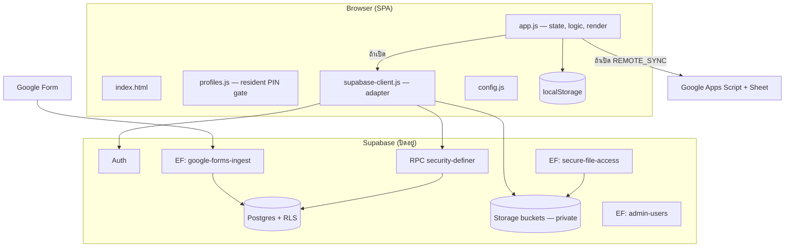
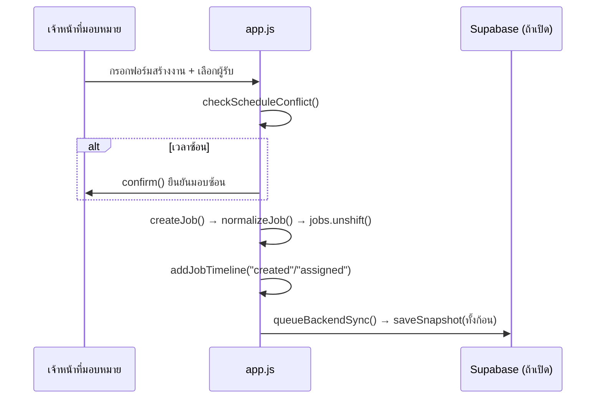
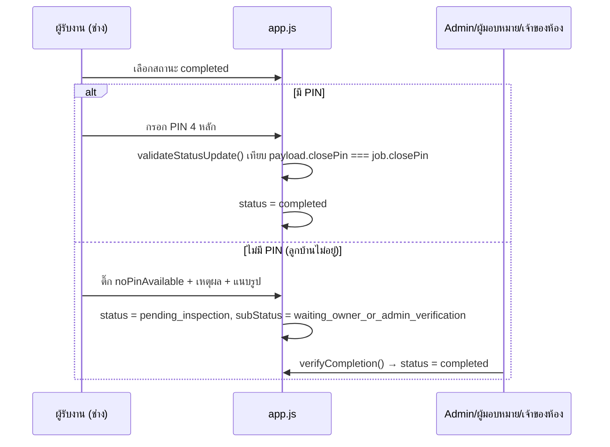

# 01 — สถาปัตยกรรมปัจจุบัน (Current Architecture)

อ้างอิงหลักฐานจากไฟล์จริง ทุกข้อความในเอกสารนี้แยกเป็น: **[ข้อเท็จจริงที่ตรวจแล้ว]**, **[น่าจะเป็นปัญหา]**, **[ข้อเสนอเชิงสถาปัตยกรรม]**, **[ข้อมูลที่ยังขาด]**

## 1. Component Inventory (บัญชีองค์ประกอบ)

| ไฟล์ | ขนาด | บทบาท |
| --- | --- | --- |
| `index.html` | 573 บรรทัด | โครง DOM ทั้งหมด, โหลด script 4 ตัว + Supabase CDN |
| `app.js` | 5,669 บรรทัด | ตรรกะทั้งหมด: I18N, state, jobs, permissions, render, event handlers |
| `profiles.js` | 243 บรรทัด | Profile gate + PIN ต่อโปรไฟล์สำหรับลูกบ้าน (ครอบ `showApp`) |
| `supabase-client.js` | 283 บรรทัด | Adapter เรียก Supabase Auth/RPC/Storage |
| `config.js` | 9 บรรทัด | ค่า config runtime (ปัจจุบันว่างทั้งหมด, Supabase ปิด) |
| `styles.css` | 1,040 บรรทัด | สไตล์ทั้งหมด |
| `supabase/migrations/202607090001_full_supabase_schema.sql` | 584 บรรทัด | schema + RLS + RPC + Storage |
| `supabase/functions/admin-users/` | 101 บรรทัด | Edge Function สร้าง/รีเซ็ตรหัสผู้ใช้ (service_role) |
| `supabase/functions/google-forms-ingest/` | 85 บรรทัด | Edge Function รับ webhook จาก Google Form |
| `supabase/functions/secure-file-access/` | 47 บรรทัด | Edge Function ออก signed URL หลังตรวจสิทธิ์ |
| `supabase-schema.sql` | 145 บรรทัด | **[legacy]** schema เฟสเก่า (บรรทัด 1–4 ระบุว่าเลิกใช้แล้ว) |

**[ข้อเท็จจริง]** สถาปัตยกรรมเป็น **static SPA แบบไฟล์เดียว** ไม่มี build step, ไม่มี `package.json`, ไม่มี lockfile, ไม่มี test framework, ไม่มี bundler โหลดผ่าน `<script>` ตรง ๆ (`index.html` บรรทัด 567–571)

**[น่าจะเป็นปัญหา]** `app.js` 5,669 บรรทัดในไฟล์เดียวเป็น God-file ทุก responsibility ปนกัน (state + view + auth + business logic) แก้ยากและเสี่ยงต่อ regression

## 2. Frontend → Backend Data Flow

**[ข้อเท็จจริง]** มี 3 เส้นทางข้อมูลใน `queueBackendSync` (บรรทัด 1589):

```
saveJobs()/saveLogs()/... → queueBackendSync()
   ├── ถ้า SUPABASE_ENABLED → queueSupabaseSync() → supabaseProvider.saveSnapshot(remoteSnapshot())
   ├── ถ้า REMOTE_SYNC + APPS_SCRIPT_URL → queueRemoteSync() → fetch(APPS_SCRIPT_URL)
   └── ค่าเริ่มต้น (ทั้งคู่ปิด) → เขียน localStorage เท่านั้น
```

**[น่าจะเป็นปัญหา]** ทั้ง Supabase และ Apps Script ทำงานผ่าน **"snapshot ทั้งก้อน"** (`remoteSnapshot()` บรรทัด 1515 รวม jobs, logs, residentRooms, users ทั้งหมด) ไม่ใช่การเขียนต่อ record ทำให้เกิด race/overwrite และลบล้างการควบคุมสิทธิ์ระดับแถว

## 3. Authentication Flow

**[ข้อเท็จจริง]** `authenticateAppUser` (บรรทัด 4656):
- ถ้า Supabase เปิด → `supabaseProvider.signIn(loginId, password)` แปลง loginId เป็น email เทียม `<id>@auth.juristic.local` (`supabase-client.js` บรรทัด 39) แล้ว `signInWithPassword`
- ถ้าปิด → เทียบ `u.room.toUpperCase() === room && u.password === password` กับ array ใน memory (plaintext)

**[ข้อเท็จจริง]** ลูกบ้านมี "ชั้นที่สอง": หลัง login สำเร็จ `profiles.js` ครอบ `showApp` และบังคับ profile gate + PIN 4 หลัก (SHA-256 hash + salt เก็บ localStorage)

## 4. Authorization Flow

**[ข้อเท็จจริง]** สิทธิ์คำนวณจากฟังก์ชัน client (บรรทัด 826–851): `hasPermission`, `hasSidebarAccess`, `canAssign`, `canManageTeam` ฯลฯ ทั้งหมดอ่านจาก `currentUser` และ `user.permissions` ใน memory/localStorage

**[น่าจะเป็นปัญหา — CRITICAL]** ไม่มีการบังคับสิทธิ์ฝั่งเซิร์ฟเวอร์ในเส้นทางที่ใช้งานจริง (localStorage) ผู้ใช้แก้ `currentUser.role = "admin"` ใน console ก็ได้สิทธิ์เต็ม ในเส้นทาง Supabase มี RLS/RPC ช่วยบางส่วน แต่ snapshot bridge ลบล้าง (ดูข้อ 5)

## 5. Database Access Flow

**[ข้อเท็จจริง]** เส้นทาง Supabase มี:
- ตารางหลัก: `rooms`, `app_users`, `room_profiles`, `jobs`, `job_close_pins`, `job_timeline`, `job_attachments`, `resident_people`, `resident_cars`, `permissions`, `audit_logs`, `google_form_submissions`, `app_snapshots` (migration บรรทัด 6–197)
- RLS เปิดทุกตาราง (บรรทัด 460–475) แต่มี policy จริงเพียงบางตาราง (`rooms`, `app_users`, `jobs`, `audit_logs`, `announcements`, `permissions`, `sidebar_preferences`)
- RPC security-definer สำหรับ workflow: `create_job`, `assign_job`, `update_job_status`, `verify_job_completion`, `create_profile`, `verify_profile_pin`, `save_client_snapshot`, `get_app_bootstrap`

**[น่าจะเป็นปัญหา]** ตาราง `resident_people`, `resident_cars`, `job_close_pins`, `job_timeline`, `job_attachments`, `room_profiles` เปิด RLS แต่ **ไม่มี policy** = client อ่านตรงไม่ได้ (deny by default) แต่ก็ไม่มี RPC อ่านข้อมูลเหล่านี้เช่นกัน → PII ลูกบ้านถูกส่งผ่าน `app_snapshots` (snapshot bridge) แทน ซึ่งไม่มีการกรองต่อบทบาท

## 6. File Upload & Storage Flow

**[ข้อเท็จจริง]** `fileToDataUrl` (บรรทัด 5403): อ่านไฟล์ → ถ้าเป็นรูป ย่อขนาด maxSide 1600px + ประทับ watermark ชื่อผู้ใช้/เวลา บน canvas → ถ้า Supabase เปิด upload เข้า bucket + คืน signed URL (หมดอายุ 3600s) → ถ้าปิด คืน data URL เก็บใน localStorage

**[ข้อเท็จจริง]** Storage buckets ตั้งเป็น private ทั้ง 3 (`job-attachments`, `announcement-files`, `profile-images`) จำกัด MIME และขนาด (migration บรรทัด 531–539) มี RLS policy บน `storage.objects` ผ่าน `can_access_storage_object` (บรรทัด 541)

**[น่าจะเป็นปัญหา]** watermark timestamp วาดจากนาฬิกา client ไม่น่าเชื่อถือในเชิงหลักฐาน (ดู `04` และ `06`)

## 7. Notification Flow

**[ข้อเท็จจริง]** มีแค่ in-app: `getNotifications`/`renderNotifications` (บรรทัด 1227) และ `showToast` **[ข้อมูลที่ยังขาด]** ไม่มี LINE OA, Web Push, หรืออีเมล ในโค้ด

## 8. External Integration Flow

**[ข้อเท็จจริง]**
- Google Form → Edge Function `google-forms-ingest` → ตาราง `google_form_submissions` + `jobs`
- Google Apps Script (`remoteRequest`, บรรทัด 1530) — เส้นทาง sync สำรอง ปัจจุบันปิด
- Google Calendar — mockup ใน UI ยังไม่ต่อ API (`renderCalendar` บรรทัด 3102 สร้าง `.ics` ฝั่ง client)
- Supabase — Auth/DB/Storage/Edge Functions

## 9. Background Job / Scheduled Task Flow

**[ข้อมูลที่ยังขาด]** ไม่มี cron/scheduled job ในโค้ด มีเพียง debounce timer (`setTimeout`) สำหรับ sync

## 10. Error Handling & Logging Flow

**[ข้อเท็จจริง]** ใช้ `console.warn` 11 จุด และ `showToast` แจ้งผู้ใช้ การ sync ล้มเหลวถูกกลืน (บรรทัด 1572, 1600) `addLog` (บรรทัด 2089) เขียน log ลง localStorage แยกตามบทบาท (admin/staff/resident) จำกัด 300 รายการ

**[น่าจะเป็นปัญหา]** ไม่มี structured logging, correlation id, หรือ error reporting กลาง log แก้ไข/ลบได้เพราะอยู่ client

## 11. แผนภาพสถาปัตยกรรม (Mermaid)



## 12. Sequence Diagrams — workflow หลัก

### 12.1 สร้างและมอบหมายงาน



### 12.2 ปิดงานด้วย PIN / fallback ไม่มี PIN



**[น่าจะเป็นปัญหา — CRITICAL]** ใน sequence 12.2 การเทียบ PIN เกิดใน `validateStatusUpdate` ฝั่ง client เท่านั้น RPC `update_job_status` ฝั่งเซิร์ฟเวอร์ **ไม่มี** ขั้นเทียบ PIN นี้ (ดู `04` และ `06`)

## ปัญหาเชิงโครงสร้าง (สรุป)

- **God-file**: `app.js` รวมทุก responsibility — ควรแยก module (state / api / render / workflow)
- **Snapshot bridge เป็น anti-pattern**: ลบล้าง RLS, เสี่ยง overwrite, ส่ง PII เกินจำเป็น — ควรเปลี่ยนเป็น RPC/endpoint ต่อ entity
- **สอง source of truth**: legacy `supabase-schema.sql` กับ migration ใหม่ ควรเก็บ migration เดียวเป็นทางการ
- **[ข้อเสนอเชิงสถาปัตยกรรม]** คงรูปแบบ modular monolith + Supabase-first ต่อไป ไม่ต้องทำ microservices เพียงแต่แยกไฟล์และย้าย workflow writes ไปเป็น RPC จริง
