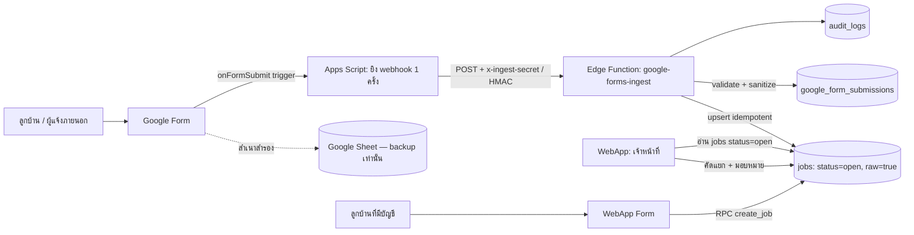
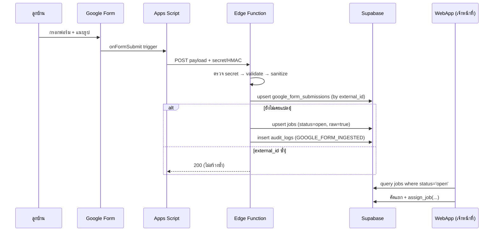

# 12 — ข้อเสนอสถาปัตยกรรม: Resident Intake Flow (แบบที่ 3)

> สถานะเอกสาร: **ข้อเสนอ (proposal) — ยังไม่ลงมือทำจริง** ยังไม่มีการแก้ source code ใด ๆ เอกสารนี้เป็นสเปกให้ทบทวน/อนุมัติก่อน จำแนก: **[fact]** ตรวจแล้วจากโค้ด, **[proposal]** สิ่งที่เสนอให้ทำ, **[open]** ต้องตัดสินใจ

## 1. วัตถุประสงค์

ออกแบบเส้นทางรับแจ้งงานจากลูกบ้าน (resident intake) แบบ **hop เดียวถึงฐานข้อมูล** โดยตัด Google Sheet ออกจากเส้นทางสร้างงาน (create job) ใช้ Supabase Edge Function ที่มีอยู่แล้วเป็นตัวรับ แทนการเด้งผ่าน Sheet → Apps Script → poll

## 2. สรุปการเปรียบเทียบ (ทำไมเลือกแบบที่ 3)

| เกณฑ์ | แบบ1: Form→Sheet→Script→WebApp | แบบ2: WebAppForm→Sheet→Create | **แบบ3: Form→Edge Function→jobs (เสนอ)** |
| --- | --- | --- | --- |
| จำนวน hop ถึง DB | 4 | 3 | **1** |
| ความหน่วง | นาที (Apps Script trigger) | ปานกลาง | **near real-time** |
| Source of truth | Sheet (คนแก้มือได้) | Sheet | **Postgres (jobs)** |
| Validation ฝั่ง server | ยาก | ไม่มี | **ทำได้ใน Edge Function/RPC** |
| Idempotency | ยาก | ยาก | **external_id unique (มีแล้ว)** |
| Quota/execution limit | ผูก Apps Script | ผูก Apps Script | **ไม่ผูก** |
| Debug/observability | ยาก | ยาก | **Edge Function logs + audit_logs** |
| Sheet ยังใช้เป็น backup ได้ | — | — | **ได้ (แยกจากเส้นทางสร้างงาน)** |

**[fact]** โครงแบบที่ 3 มีอยู่แล้วบางส่วนใน `supabase/functions/google-forms-ingest/index.ts` และตาราง `google_form_submissions` + `jobs` ใน migration — เอกสารนี้แค่ทำให้มันเป็นเส้นทางหลักและปิดช่องโหว่

## 3. เส้นทางเป้าหมาย (Target Flow)



หลักการ:
- **ผู้แจ้งภายนอก / ไม่มีบัญชี** → Google Form → Edge Function → `jobs`
- **ลูกบ้านที่ login** → WebApp form → RPC `create_job` → `jobs` (ไม่ผ่าน Form/Sheet)
- **Google Sheet** → ให้ Google Form เขียนตามปกติเพื่อเป็น **สำเนาสำรอง/ดูย้อนหลัง** เท่านั้น ไม่ใช่ตัวสร้างงาน

## 4. Data Contract (payload webhook → jobs)

**[proposal]** Apps Script ยิง JSON นี้มาที่ Edge Function (อิงฟิลด์ที่ `google-forms-ingest` อ่านอยู่แล้ว บรรทัด 30–59):

```jsonc
{
  "external_id": "<Form response ID>",   // ใช้กัน duplicate (idempotency key)
  "timestamp": "<ISO ที่ Form ส่ง>",
  "roomNo": "A-1204",
  "building": "A",
  "floor": "12",
  "contactName": "ชื่อผู้แจ้ง",
  "contactPhone": "08xxxxxxxx",
  "description": "รายละเอียดปัญหา",
  "category": "building",               // optional
  "priority": "normal",                 // optional
  "photos": ["<url/ไฟล์แนบจาก Form>"]   // optional (ดูข้อ 7)
}
```

**[proposal]** Edge Function map เป็น job:
- `status = "open"`, `raw = true`, `source = "Google Form"`
- ทุกฟิลด์ข้อความ **sanitize** (strip/encode `<` `>` และ HTML) ก่อนเก็บ — ปิดต้นเหตุ XSS
- เก็บ `formSubmissionId` อ้างกลับไป `google_form_submissions`

## 5. Sequence — ตั้งแต่ลูกบ้านกดส่งจนเจ้าหน้าที่เห็น



## 6. สิ่งที่ต้องแก้ (สเปก — ยังไม่ทำ)

**[proposal]** เรียงตามความสำคัญ:

1. **บังคับ webhook secret เสมอ** — ปัจจุบัน `google-forms-ingest:20-22` ข้ามการตรวจถ้า `expectedSecret` ว่าง ต้องเปลี่ยนเป็น: ถ้าไม่ตั้ง secret → ปฏิเสธทุก request (fail closed) และเสริม HMAC + ตรวจ timestamp กัน replay
2. **Sanitize payload** — ทุกฟิลด์ข้อความก่อนเขียน `jobs.payload` (ปิด XSS ที่ต้นทาง เสริมกับการ `esc()` ฝั่ง render ใน Batch 1)
3. **Idempotency ให้แน่น** — ใช้ `external_id` (Form response ID) เป็น key จริง และให้ job id ผูกกับ `external_id` แทน `Date.now()` (`google-forms-ingest:43`) เพื่อ retry ไม่สร้างงานซ้ำ
4. **จำกัด CORS** — เปลี่ยนจาก `*` เป็นโดเมนที่เชื่อถือ (Google Apps Script origin / ไม่ต้องเปิด browser CORS ถ้าเรียก server-to-server)
5. **WebApp เลิก path Sheet** — ในโค้ด WebApp (`app.js`) เส้นทางสร้างงานของลูกบ้านที่ login ควรไป RPC `create_job` ตรง ไม่แตะ Sheet/Apps Script sync (ลดบทบาท `queueRemoteSync`/`remoteRequest` บรรทัด 1530–1588)
6. **สถานะ raw pool** — WebApp อ่านงาน `status='open' & raw=true` มาแสดงใน "งานจากG-Form" ให้เจ้าหน้าที่คัดแยก (มี view นี้อยู่แล้วตาม README)

**ไม่แตะ**: UX/UI, layout, การ render (นอกจาก escape ที่อยู่ Batch 1), โครงสร้าง `jobs` table

## 7. เรื่องรูปแนบจาก Google Form **[open]**

Google Form เก็บไฟล์แนบไว้ใน Google Drive ของเจ้าของฟอร์ม มี 2 ทางเลือก:
- **7a** Edge Function ดึงไฟล์จาก Drive แล้ว re-upload เข้า Supabase Storage bucket `job-attachments` (แนะนำ — รูปอยู่ที่เดียว, มี signed URL, ตรงกับ security model) — ต้องใช้ Drive API scope
- **7b** เก็บแค่ Drive link (ง่ายกว่า แต่รูปอยู่ Drive, ผูก permission Drive, ไม่ผ่าน RLS ของระบบ)

ต้องเลือกก่อนทำจริง — ผมเอนไปทาง 7a เพื่อให้หลักฐานอยู่ในระบบเดียว

## 8. Rollout (เมื่อได้รับอนุมัติ)

1. ตั้ง Supabase **staging** + deploy Edge Function เวอร์ชันที่ปิดช่องโหว่
2. ทำ Google Form ทดสอบ + Apps Script trigger ยิงเข้า staging
3. รันทดสอบ (ข้อ 9) ด้วยข้อมูล **ปลอม**
4. เปิด `SUPABASE_ENABLED=true` เฉพาะ staging → ตรวจ end-to-end
5. ค่อยเลื่อนไป production พร้อม secret จริง (ห้ามใส่ service_role ในฝั่ง frontend)

## 9. Acceptance Tests

| # | Given | When | Then |
| --- | --- | --- | --- |
| I-1 | Edge Function ไม่ได้ตั้ง secret | ยิง webhook | ปฏิเสธ 403 (fail closed) |
| I-2 | secret ถูกต้อง | ยิง 1 ครั้ง | สร้าง 1 job status=open, raw=true, มี audit log |
| I-3 | external_id เดิม | ยิงซ้ำ 2 ครั้ง | ได้ 1 job (idempotent) |
| I-4 | payload มี `<script>` | ยิง + staff เปิดงาน | แสดงเป็น text ไม่ execute |
| I-5 | ลูกบ้าน login | แจ้งผ่าน WebApp form | job สร้างผ่าน RPC create_job ไม่แตะ Sheet |
| I-6 | มีรูปแนบ (ถ้าเลือก 7a) | ยิง webhook | รูปอยู่ใน bucket job-attachments + signed URL |
| I-7 | เจ้าหน้าที่ | เปิด "งานจากG-Form" | เห็นงาน raw รอคัดแยก |

## 10. คำถามที่ต้องตอบก่อนเริ่มทำจริง **[open]**

1. ลูกบ้านส่วนใหญ่แจ้งงานแบบ **มีบัญชี login** หรือ **Google Form**? (กำหนดว่า Form เป็นช่องทางหลักหรือสำรอง)
2. รูปแนบ: เลือก 7a (re-upload เข้า Supabase) หรือ 7b (เก็บ Drive link)?
3. ยังต้องเก็บ Google Sheet เป็น backup หรือเลิกทั้งหมด?
4. Apps Script `/exec` เดิม (ตาม `DEPLOYED-URLS.md`) จะเลิกใช้เมื่อย้ายมาแบบนี้หรือไม่?

---
**สรุป**: แบบที่ 3 ให้เส้นทางสั้นสุด ปลอดภัยสุด และใช้ของที่คุณเขียนไว้แล้วเป็นส่วนใหญ่ เพียงแต่ต้องปิดช่องโหว่ (secret, sanitize, idempotency, CORS) ก่อนเปิดใช้จริง — งานเหล่านี้ทับซ้อนกับ Batch 1 ในรายงาน `10-remediation-roadmap.md`
